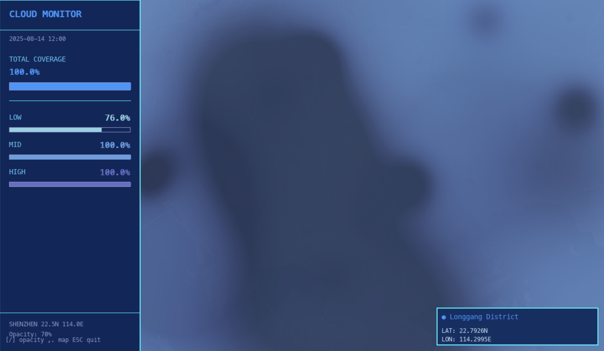
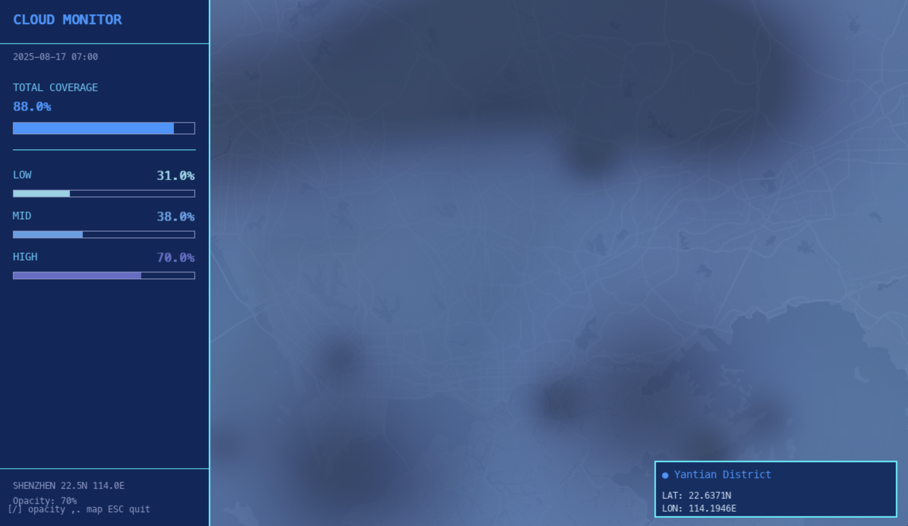
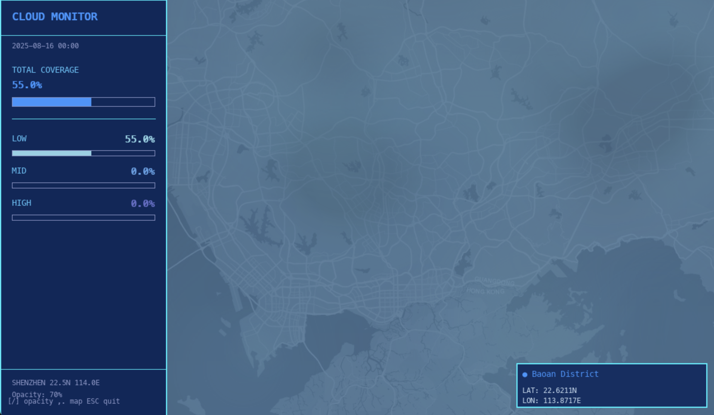
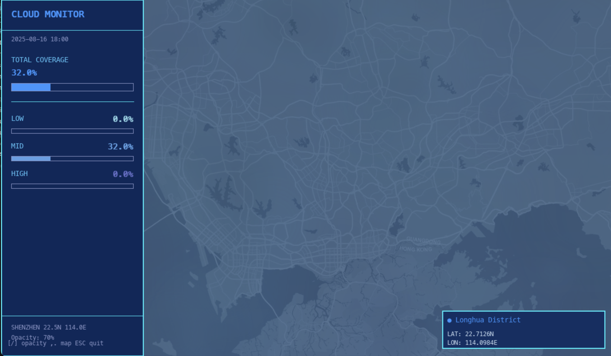

# Shenzhen Cloud Coverage Visualization

A retro-futuristic, Mac OS 3 inspired visualization of Shenzhen's cloud coverage with smooth, cyan-teal-amber dynamic contours rendered in Pygame. Features a classic CRT-style left sidebar panel displaying real-time data metrics with progress bars, and a main visualization area with deep charcoal backgrounds. The highest cloud amounts shift from cyan-teal toward warm amber tones.

## Showcase

The visualization displays real-time cloud coverage levels across three altitude bands (Low, Mid, High) with smooth gradient rendering:

### Full Cloud Coverage (100% Total)

High cloud coverage displays all three layers at maximum intensity, with dense cloud formations and vibrant blue-cyan coloring.

### High Cloud Coverage (88% Total)

High cloud coverage displays all three layers at maximum intensity, with dense cloud formations and vibrant blue-cyan coloring.

### Medium Cloud Coverage (55% Total)

Medium coverage shows partial cloud formations with a mix of low and mid-altitude clouds, demonstrating the gradient rendering capabilities.

### Low Cloud Coverage (32% Total)

Low coverage shows minimal cloud formation primarily in the mid-altitude layer, with the Shenzhen basemap clearly visible underneath.

## What's inside

- Pygame animation (`cloudCover_sz.py`)
  - **Retro-futuristic UI**: Mac OS 3 inspired design with CRT green text and amber highlights
  - **Left sidebar panel (280px)**: Real-time cloud data display with monospace fonts and progress bars
  - **Main visualization area**: Smooth, coherent flow using Gaussian scalar fields with cyan-teal-amber color palette
  - Deep-colored Shenzhen basemap underlay (Esri Dark Gray + cyan-teal tint)
  - Motion and visual intensity scale with cloud coverage
  - Keyboard controls for opacity and basemap blending
- Static charts (`cloudCover_sz_img.py`)
  - Time series and heatmap for August
  - Optional GUI pop-up with `--show`
- Sample data: `CloudSZ22.50N114.00E.csv`
- Example outputs in `outputs/` (PNG)

## Repository layout

- `cloudCover_sz.py` – Pygame animated visualization
- `cloudCover_sz_img.py` – Matplotlib plots (time series + heatmap)
- `CloudSZ22.50N114.00E.csv` – Input CSV with cloud cover data
- `requirements.txt` – Python dependencies
- `assets/`
  - `shenzhen_basemap_dark.png` – Cached deep-color basemap (auto-fetched if missing)
  - `shenzhen_basemap.png` – Legacy light basemap (not used by default)
- `outputs/`
  - `cloud_heatmap_august.png`
  - `cloud_timeseries_august.png`

## Requirements

- Python 3.9+ (tested on macOS)
- pip to install dependencies

Install dependencies:

```zsh
python3 -m venv .venv
source .venv/bin/activate
pip install -r requirements.txt
```

If you don’t use a virtual environment, omit the first two lines and install system-wide or user-wide.

## Data format

The scripts expect a CSV with at least the following columns:

- `time` – Date/time in a parseable format
- `cloud_cover (%)`
- `cloud_cover_low (%)`
- `cloud_cover_mid (%)`
- `cloud_cover_high (%)`

By default, the visualization filters to August and uses the provided `CloudSZ22.50N114.00E.csv`. To use a different file, change the `DATA_FILE` constant near the top of `cloudCover_sz.py` and `cloudCover_sz_img.py` (if applicable) or replace the CSV file with the same name.

## How to run (animated visualization)

Run the Pygame visual:

```zsh
python3 cloudCover_sz.py
```

First run will try to load `assets/shenzhen_basemap_dark.png`. If not found, the app fetches a deep, dark basemap from Esri and caches it there, then applies a subtle deep-blue tint overlay for contrast.

### Controls

- Esc – Quit
- `[` / `]` – Decrease / increase cloud layer opacity
- `,` / `.` – Decrease / increase basemap opacity
- `r` – Re-fetch the basemap (deep tint is reapplied)
- `s` – Save a screenshot to `assets/preview_YYYYMMDD_HHMMSS.png`

### Visual behavior

- **Retro aesthetic**: Mac OS 3 inspired design with custom blue-themed color palette
- **ASCII-style cloud rendering**: 
  - Fine-grained pixelated visual style using nearest-neighbor scaling
  - Refined quantized intensity levels (12 levels) for smooth gradations
  - **Gradient edges**: Subtle transparency fade at block boundaries (2x2 pixel blocks for refined detail)
  - **Breathing animation**: Gentle pulsing effect (85%-115% intensity cycle)
  - Subtle dithering patterns (checkerboard + scanlines) for delicate texture
  - Dense ASCII character overlay (`.·:░▒▓█`) at 8-pixel spacing with 7pt font
  - Character opacity and selection varies with cloud intensity and breathing rhythm
- **Left data panel**: Displays TOTAL COVERAGE with vibrant blue accent and progress bar, plus LOW/MID/HIGH metrics with color-coded mini bars
- **Right visualization area**: Total, Low, Mid, High coverage shown as ASCII-style pixelated contour fields
- The Total layer's color smoothly shifts from bright blue toward vibrant accent blue as coverage increases
- Motion gets more obvious when the total coverage is high: the flow speed scales from ~0.9× (clear) up to ~2.5× (overcast)
- Deep blue background (RGB 14, 47, 100) with subtle gradient and optional Shenzhen basemap
- Monospace fonts (Monaco/Courier) throughout for authentic retro computing feel

## How to run (static charts)

Generate August plots to `outputs/`:

```zsh
python3 cloudCover_sz_img.py
```

Show the plots in a pop-up window (blocks until closed):

```zsh
python3 cloudCover_sz_img.py --show
```

If a GUI is available, the script will try common backends (Qt/Tk/Mac) to display the window.

## Configuration notes

- **UI Layout**: Left sidebar is 280px wide, main visualization fills the remaining space (920px on 1200px screen)
- **Color palette**: Custom blue-themed scheme
  - Primary theme / Background: RGB(14, 47, 100) - Deep blue
  - Secondary theme: RGB(97, 143, 159) - Teal-gray
  - Accent colors: RGB(64, 109, 242) - Vibrant blue / RGB(101, 216, 223) - Cyan
  - Text: RGB(89, 170, 245) - Bright blue / RGB(99, 100, 138) - Muted gray
  - Cloud colors: Blue-cyan gradient with accent highlights at high coverage
- Basemap source: Esri Dark Gray Canvas via the public export endpoint. The cached file is `assets/shenzhen_basemap_dark.png`.
- Basemap tint: A subtle cyan-teal overlay is applied for retro aesthetic consistency. You can adjust opacity in code or with `,`/`.` at runtime.
- Month filter: The animation currently filters data to August. Modify the filter in `cloudCover_sz.py` if you'd like a different period.
- Fonts: Monospace fonts (Monaco preferred, falls back to Courier New/Courier) for authentic retro computing look.

## Troubleshooting (macOS)

- Pygame window not showing or black:
  - Ensure the right Python is active (`which python3`) and that `pygame` is installed into that environment.
  - Close other apps that may be capturing GPU resources and try again.
- Basemap not loading:
  - Check your internet connection on first run (to cache the basemap).
  - Verify `assets/` is writable. You should see `shenzhen_basemap_dark.png` appear after the fetch.
- Matplotlib `--show` does nothing:
  - Some headless setups can’t open windows. Remove `--show` to just save images, or try a different GUI backend.

## Credits

- Basemap tiles: Esri Canvas (Dark Gray Base). Data and imagery © Esri and its contributors.
- Visualization: Gaussian scalar fields, soft contour shading, and coherent flow implemented in `cloudCover_sz.py`.

## Notes for development

- Code is formatted for clarity with minimal external dependencies: `numpy`, `pandas`, `pygame`, `matplotlib`, `requests`.
- When changing public behavior (e.g., month filter or color mappings), prefer adding small constants near the top of the file for easy tuning.
- Contributions: open an issue or PR with a concise description of the change and a short before/after explanation or screenshot.
